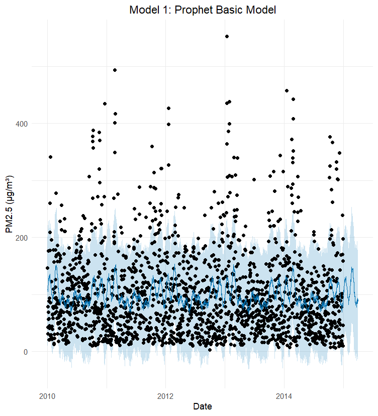
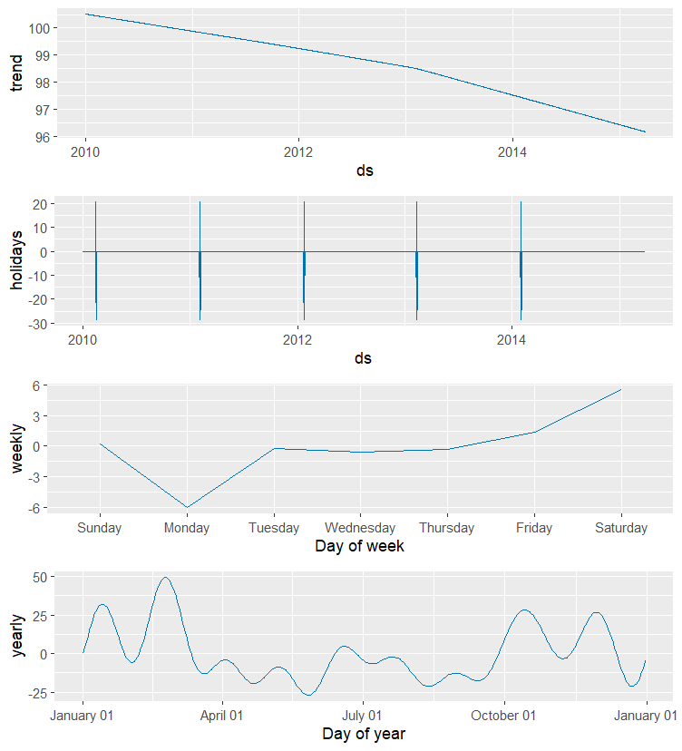

# Forecasting Beijing Air Quality: A Prophet Model Analysis 🏭⛅

## Overview
This project analyses and forecasts atmospheric PM2.5 concentrations in Beijing using Meta’s **Prophet** algorithm in R. By leveraging daily air quality measurements from January 2010 to December 2014, this analysis demonstrates how to evolve a basic time-series forecast into a robust, culturally-aware, and mathematically stable model.

## Data Source
The dataset contains daily meteorological and pollution readings from the US Embassy in Beijing (2010–2014). Data was cleaned and aggregated to daily averages using `dplyr` and `lubridate`.

## Methodology & Modeling
This project explores time-series forecasting through three progressive iterations:

### 1. The Baseline Model
An basic Prophet model was initialised to establish a baseline. While it correctly identified the macro-level seasonal wave (higher pollution in winter), it failed to capture the extreme variance of the winter spikes, leaving many actual observations outside the 80% prediction interval.

### 2. Adding Cultural Context (The Lunar New Year)
Time-series algorithms only understand time, not culture. To account for the massive pollution surges caused by holiday fireworks and the subsequent dips from factory closures, a custom `holidays` dataframe for the Chinese New Year was injected into the model.

*The components plot above isolates the exact mathematical impact of the Lunar New Year, alongside the long-term macro trend and the yearly "Coal Winter" heating cycle.*

### 3. Addressing Heteroscedasticity (Log Transformation)
Environmental data is highly heteroscedastic—the variance of the pollution spikes scales with the concentration levels. To stabilize this variance and generate honest, symmetric prediction intervals, a `log1p` transformation was applied. The final forecast was back-transformed using `expm1()` for human interpretability.

## Key Insights
1. **Seasonality is King:** PM2.5 in Beijing is heavily dictated by the winter heating cycle (starting in November) and weekly industrial output.
2. **Culture Breaks Algorithms:** Out-of-the-box models fail during cultural anomalies like the Lunar New Year. Explicitly coding holiday parameters is vital for environmental forecasting.
3. **Variance Requires Transformation:** The `log1p` transformation successfully widened the model's prediction intervals during the winter months, ensuring future extreme PM2.5 observations fall within the bounds of uncertainty.

## How to Run This Project
1. Clone this repository.
2. Ensure the `PRSA_data_2010.1.1-2014.12.31.csv` is located in the `data/` directory.
3. Install the required packages (`dplyr`, `lubridate`, `ggplot2`) and the latest release of `prophet` via `remotes::install_github('facebook/prophet@*release', subdir='R')`.
4. Run the `.Rmd` file in RStudio to reproduce the analysis and generate the plots.
